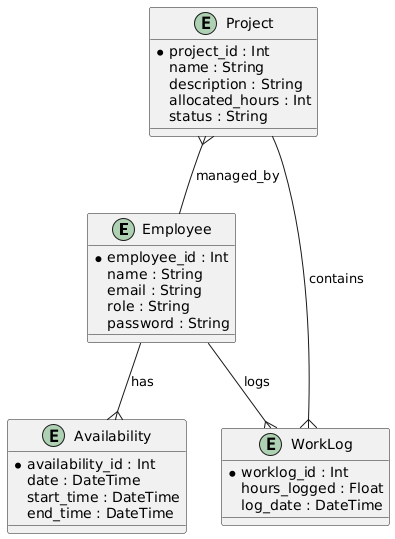
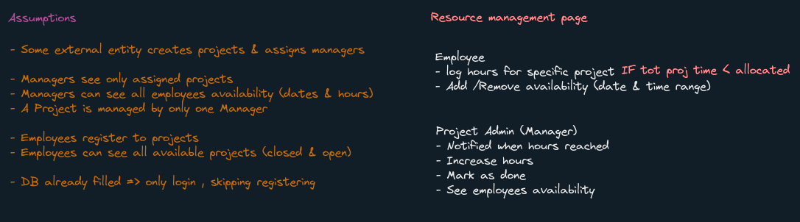

## Running the project

### Prequises
- Node.js
- npm

### Steps
1. Clone this repository
2. Open a terminal and cd to the cloned directory 
3. run `npm install`
4. run `npx prisma migrate dev`
5. run `npm run start`

# Database design 
In this project an `sqlite database` was used for ease of trying out this project 
Designed the DB according to [assumptions](#workflow) 

# Thought process
When it comes to APIs usually this is what I develop in this order:
- ORM + Entity models (Prisma , used entity models differently here)
- DB Migration + Seeding 
- Repository pattern (Prisma)
- Services + DTO models
- Controllers
- Middleware (Nest guard + pipeline)

# Workflow

1. Understanding the requirements , in order to limit the scope due to short deadline assumptions were made and designed the DB accordingly

2. Understanding Prisma and creating database through migration
3. Understanding NestJs best practices and structure through research while implementing API logic
4. Consuming NEstJs API through the React frontend

- `Learned and applied:` 
1. Prisma ORM schema , commands , migration (considered it as repository pattern)
2. NestJs 
	- structure (module,controller,service,decorators,DI)
	- different commands
	- validation through validation pipelines & dto
	- authentication through Nest JWT module (couldn't use Passport library due to time)
	- authorization through guards
	- service error handling using built in exceptions

# Challenges
- Keeping development planning to project scope and simplifying to make it more achievable 
- Learning and developing in NestJS in the short deadline
- Some polishing like encrypting passwords , prisma seeding were skipped due to time